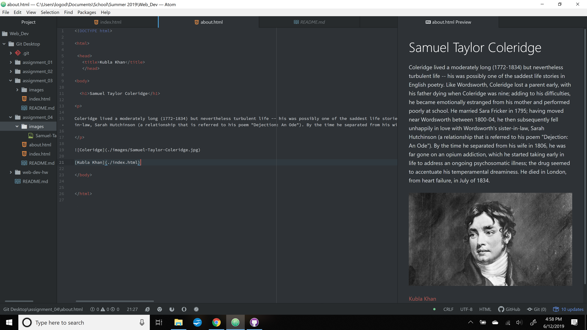

<!DOCTYPE html>

<html>

 <head>
   <title>Kubla Khan</title>
   </head>

<body>

  <h1>The Way Back</h1>

Using "The Way Back Machine" waas a trip.  The first site I wanted to look at was StumbleUpon, really mostly for nostalgia's sake.  The thing I thought was really interesting was when I looked at the spec of how often the site was used to view that particular site, the stats were really high even compared to much more popular sites.  Other than that, I looked at the university's site and a few other big ones with well-defined and well designed logos and sleek site structure. It was both amusing and illuminating to see the differences.  Looking back in the archives

<h1>GIT Module</h1>

I was already a little familiar with this setup having taken Creative Coding, so fortunately all the blood, sweat, and tears from that class turned out to be worth it.  When I was first learning there were things I spend inordinate amounts of time stressing about, just to find out a little further down the road that I had simply overthought and misunderstood and it's actually all quite straightforward and incredibly intuitive.

</body>

</html>
