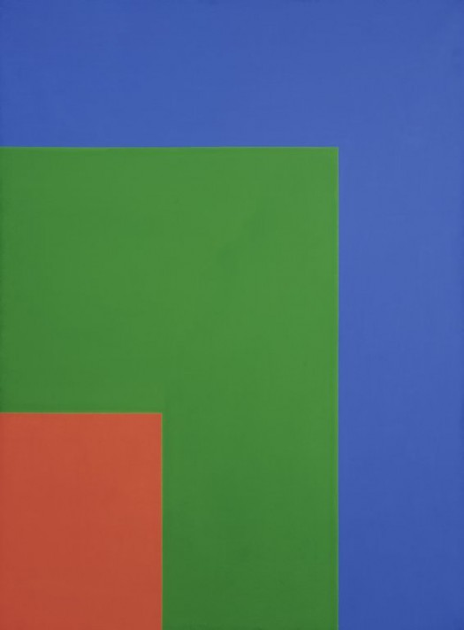

<!DOCTYPE html>

<html>

 <head>

   </head>

<body>

  <h1>README Assignment 11</h1>

  <h2></h2>

  <h2>OG Artwork</h2>

  

      
      Red Green Blue by Ellsworth Kelly (1964)
  

  <h2>Find Out More About the Artist</h2>
  <nav>
    <a href="http://www.artnet.com/artists/ellsworth-kelly/">Ellsworth Kelly</a>

<h2>Work Cycle</h2>

  

  

</body>

</html>
