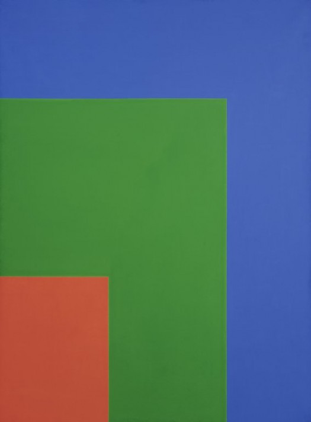

<!DOCTYPE html>

<html>

 <head>

   </head>

<body>

  <h1>README Assignment 11</h1>

  <h2>Padding, Margin, and Borders</h2>

Padding refers to the amount of space between teh inner content of the element and the element itself.  The margin refers to the space between the box or element and different elements, or the edge of its parent/grandparent element(s). Margins accept both absolute or relative elements.  Borders help define the amount of space a box or element takes up and its positional relative arrangement with relation to other boxes.  The difference between borders and margin/padding is that the border part of a box can be separately colored and has multiple style options (better used for visual styling tool than for space mgmt.)

  <h2>OG Artwork</h2>

  

      
      Red Green Blue by Ellsworth Kelly (1964)
  

  <h2>Find Out More About the Artist</h2>
  <nav>
    <a href="http://www.artnet.com/artists/ellsworth-kelly/">Ellsworth Kelly</a>

 
 
 

<h2>Work Cycle</h2>

  

My work cycle this time ended up being super erratic because I looked over the materials and just thought I understood plenty well enough to just wing the assignment.  It took a few hours of frustration and belligerent denial before I gave in and set my pride aside.  Then I started methodically going through the relevant bits of information and within less than twenty minutes it turned into the easiest project in the world.  I somehow got caught up on the placement thing and was trying to figure out workarounds so that each of my images wasn't sitting up against the previous image, and couldn't figure out how to overlap embedded images.  Then I realized I didn't even need to use my carefully searched-for rectangles at all, that I had plenty of understanding of rectangles and could just code them in without using the images at all.  The only thing I'm even slightly good at in the world is color matching (that's not been super evident in this class, but that's due to poor time management, I'm actually awesome at anything to do with color palette choice or matching, and playing around with rgb values is just my favorite thing ever!).  So once I had a breakthrough in understanding positional elements I finished the whole thing in just a few minutes.  Embedding the original artwork and linking to the artist was obviously easy since we've done that sort of thing a million times now.  This was a really fun and illuminating project :)
  

</body>

</html>
